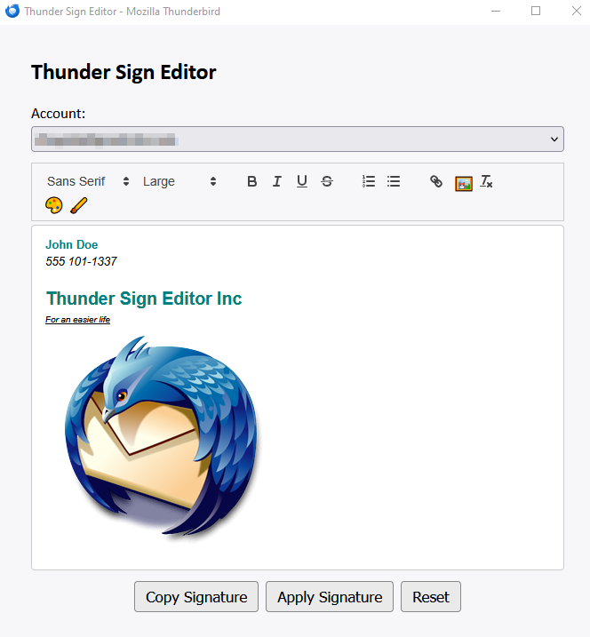
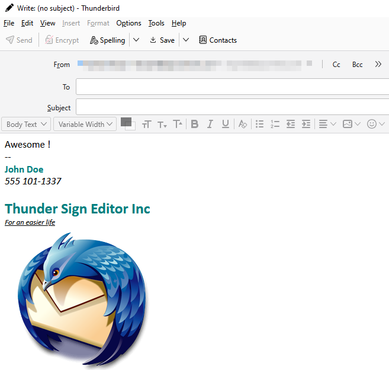

# Thunder Sign Editor ✍️  
**Visual signature editor for Thunderbird**

**Thunder Sign Editor** is a lightweight Thunderbird extension that lets you visually design, copy, and apply email signatures to any of your Thunderbird identities.  
Built with simplicity and flexibility in mind, it includes rich text editing features like font control, color pickers, and image insertion.

---

## ✨ Features

- WYSIWYG (What You See Is What You Get) editor based on **QuillJS**
- Apply **HTML signatures** directly to Thunderbird accounts
- Select text color and background with **custom color pickers** 🎨
- Control **font style**, **size**, and formatting (bold, italic, underline, etc.)
- Add **links** and **images** to your signature
- **One-click copy** to clipboard
- **Reset** your signature easily

---

## 🧰 Technologies Used

- **Thunderbird WebExtensions API**
- **Quill.js** for the visual editor
- **JavaScript**, **HTML**, and **CSS**
- **ChatGPT** (for assistant development support)

---

## 🛠️ Developer Notes

This extension uses:

- `accountsIdentities` and `compose` permissions to access and modify user identities.
- A standalone popup window via `browser.windows.create()` to simulate a native app-like UI.

---

## 📸 Screenshots

| Editor Interface | Resulting Signature |
|------------------|---------------------|
|  |  |

---

## 🧭 Roadmap / TODO

- [x] Create account list selector
- [x] Add custom color picker
- [x] Open popup in standalone window
- [ ] **Add move and resize picture options**
- [ ] **Add recovery option**

---

## 👨‍💻 Author

Made with ❤️ by **[black syphilis]**

---

## 📄 License

This project is licensed under the [MIT License].
